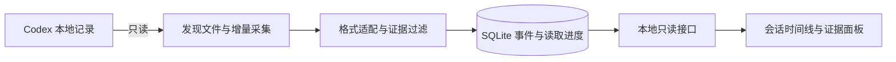

# M0 / M1 实现记录

更新：2026-10-05。版本：`0.1.0-alpha.1`。本次交付是可运行的本地观察与回放原型。

本文件描述当前能力；逐批改动见 [开发履历](development-log.md)，执行路径与状态规则见 [关键逻辑](logic.md)，统一入口见 [工程档案](README.md)。

## 已实现的用户流程

1. 启动时指定项目；默认找到当前用户的 Codex `sessions` 目录，也可显式指定来源。
2. 自动发现属于该项目及其子目录的历史会话；持续读取新增内容。
3. 在浏览器选择会话，查看消息、操作、执行反馈和回合事件。
4. 展开单条内容，点击查看对应来源路径、行号、字节偏移和记录。
5. 按类型筛选、搜索已加载内容、加载更早记录；刷新时保留已展开条目。
6. 退出后重新启动，沿已提交进度继续读取。来源重写时保留旧代次。

本轮已经用当前 Demine 项目的真实记录验证自动接入；无需用户复制对话，也不要求 Agent 主动调用上报工具。

## 模块与数据流

| 位置 | 已实现职责 |
| --- | --- |
| `src/main.rs` | 参数、来源定位、数据目录、单次扫描、本地服务启动与退出 |
| `src/collector.rs` | 项目边界、文件发现、完整行读取、前缀校验、重写代次、错误报告 |
| `src/adapter.rs` | Codex 表示适配、消息与操作分类、排除已知内部指令和推理类型 |
| `src/store.rs` | SQLite 模式、事务、检查点、事件更新、保守展示归并、分页与证据查询 |
| `src/server.rs` | 网页资源、只读接口、来源访问限制、后台采集循环 |
| `web/src/app.ts` | 会话选择、增量合并、折叠、证据查看、筛选、搜索与断线提示 |
| `web/public/` | 网页与样式，以及由 TypeScript 生成并随 Rust 编译的 JavaScript |
| `tests/` | 采集、接口、浏览器端到端测试 |

## 存储与接口契约

SQLite 使用 WAL；每个数据库绑定一个规范化项目路径。`sessions` 保存会话，`sources` 保存文件读取进度，`records` 保存经过边界过滤的行级证据，`events` 保存可展示条目。当前数据库模式版本为 2；版本 1 自动迁移，过滤此前误存的压缩内部字段，保留进度与历史；拒绝用本程序打开更高模式版本写入。

- 同一批的证据、事件、偏移及摘要在一个事务提交。
- 工具请求和结果具有一致调用 ID 时更新同一条目，不把返回当成一次新尝试。
- 同名命令的不同调用 ID 保留为不同尝试。
- 用户/助手消息的多种表示只做有限的展示归并，规则和局限见 ADR-006。
- `events.id` 决定展示顺序；`revision` 对应最后关联的证据记录 ID，因此迟到的工具结果仍能被增量查询发现。
- 界面独立维护历史分页边界；迟到的旧事件更新不会跨过未加载历史，较旧响应不能覆盖较新修订。
- 来源文件已读部分发生变化时，增加 `generation` 并重新采集；保留旧代次证据。
- 目前逐文件采集；不同来源之间不推断因果顺序、父子关系或完整行为树。

| 只读接口 | 用途 |
| --- | --- |
| `GET /api/status` | 项目、来源、版本及最近一次扫描的计数和错误 |
| `GET /api/sessions` | 会话列表与可见记录统计 |
| `GET /api/sessions/{id}/events` | 默认最近 100 条；`before` 加载更早记录，`after` 按修订游标获取更新；两者互斥 |
| `GET /api/events/{id}/evidence` | 对应来源证据；不存在时返回 404 |

事件分页单页最多 200 条。增量响应还包含需要移除的低优先级展示条目 ID。证据接口目前最多返回同一事件的前 100 条来源；尚未提供证据分页。界面搜索与筛选仅作用于已加载内容。

## 证据边界

已适配用户/公开助手消息、函数与自定义工具请求/返回、部分原生命令/工具/文件事件、回合开始/结束/中断及上下文压缩标记。

命令退出码为 0 仅表示该命令的执行状态；工具返回或回合结束不会被解释为工程问题已解决。原生记录明确标记失败时，即使没有退出码也保留失败状态。根因、替代方案为何失败、验证是否充分，需要后续分析及人的判断。单次扫描存在错误时仍输出 JSON 报告，并返回非零退出码。

已知隐藏推理、分析通道及系统/开发者消息不导入；`session_meta` 和 `turn_context` 只保留定位字段，上下文压缩不导入其替换历史；`response_item/compaction` 使用字段白名单，不保存其密文与内部附加元数据。其他未知类型和无法解析的行保留为待识别证据，因此数据库不是完整日志备份，也不是通用敏感内容清洗器。

来源只读，所有网页数据按普通文本显示。服务仅绑定 `127.0.0.1`，校验 Host 与浏览器 Origin，限制页面加载来源且禁止缓存。没有账号系统、网络同步或模型调用。本地数据库是明文文件，受当前用户的文件权限保护。

## 已验证与尚未验证

已验证 Windows 上的 Codex `0.160.0` 本地桌面会话，以及人工构造的兼容性与故障样例；详情见 [测试记录](testing.md)。本轮真实样本中 `ImageView` 和原生 `ContextCompaction` 仍按未知记录保留，未自动解释其内容。已完成一轮 [OCR 委托自查](ocr-review.md)，确认的 5 项缺陷均已修复并增加回归测试。

已推送并建立 [草稿 PR #1](https://github.com/cn7shi/Demine/pull/1)。首次云端 Linux Rust 与 Chromium 浏览器检查通过，Windows 暴露了缺失历史子目录的路径归属问题；已修复并补回归，本地 27 项 Rust 测试通过，修复后的云端结果见 [测试记录](testing.md)。Linux 覆盖人工构造案例，尚无该平台真实 Codex 会话接入证据。

当前限制：

- 每轮遍历来源目录并校验已读前缀；文件很大时可能增加磁盘读取和界面等待。扫描与接口共用数据库锁，尚未做性能压测。
- 单文件新增内容整批处理，尚未提供超大记录的内存上限或批次背压。
- 来源假定为 UTF-8 JSONL。未写完的行会等待；完整行含损坏的 UTF-8 字节时当前会使用替换字符，不能承诺损坏文件的逐字节备份。
- 会话头读取上限为 4 MiB；超长头当前表现为等待完整记录。
- 同一路径重写已支持；归档移动、跨文件复制、相同会话多来源去重及多进程同时采集未作为支持场景。
- 暂无图形化接入向导、关闭服务按钮或后台自启安装；启动入口为命令行。
- 原型不支持云会话、历史代码快照恢复、完整行为树、跨会话问题关联。

## 下一步

1. 用真实使用中的遗漏与重复样例收紧适配规则，并持续补充可公开的最小测试材料。
2. 进入 M2，定义并验证“问题—尝试—观察—判断修正—验证”的组织方式，结论必须链接证据。
3. 加入可纠错的经验条目和独立个人笔记；重新分析不覆盖人的内容。
4. 在采集可靠的基础上增加 MCP 查询与打开界面的入口。

本轮未实现 AI 经验归纳、笔记、知识库、MCP 或安装包。当前实现、修复与档案通过功能分支和草稿 PR 留档，尚未合并或发布；提交记录见 [开发履历](development-log.md)。
