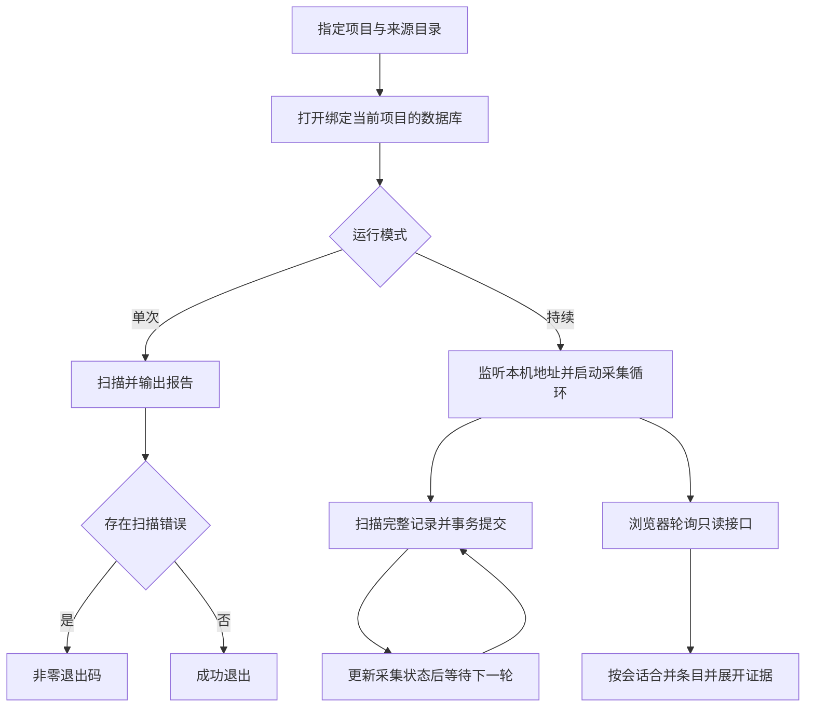

# M0 / M1 关键逻辑说明

核对日期：2026-10-05。对应代码基线 `b3ff2ac`，数据库模式为 2。本文解释已经存在的行为；产品范围见 [实现记录](implementation.md)，取舍见 [决策记录](decisions.md)。

## 1. 从启动到界面

代码入口：[main.rs](../src/main.rs) 的 `main`、[server.rs](../src/server.rs) 的 `collect_loop` 与 `router`。

后台采集放在阻塞任务中，扫描结束后等待配置的间隔；浏览器每 2 秒刷新。数据库目前由扫描与接口共享一把锁，因此大规模扫描可能影响读取延迟，尚无性能上限承诺。前台按 `Ctrl+C` 结束服务并通知采集任务退出。

## 2. 文件是否属于这个项目

入口：[collector.rs](../src/collector.rs) 的 `normalized_path`、`belongs_to_project`、`read_file`。

发现 `.jsonl` 文件后，先读会话头中的工作目录，再决定是否导入正文。目录必须是绝对路径，并且等于指定项目或位于其真正的子目录内。比较使用路径分隔符边界：选择 `/work/demo` 时，不会把 `/work/demo-other` 当成子目录。Windows 路径比较统一大小写与分隔符。

来源目录扫描不跟随符号链接。路径可访问时优先使用规范路径；不可访问时使用词法规范化，以支持来源中已经被删除的历史工作目录。会话头损坏或缺少项目归属时不导入正文，而是报告错误。

数据库另存项目绑定，避免两次启动误把不同项目写进同一个数据目录。项目校验不等于账号授权；这是单用户本地工具。

## 3. 续读、半行与来源重写

检查点包含来源代次、已提交字节偏移、原始行号、已读前缀摘要与最近已知回合 ID。

| 遇到的情况 | 当前处理 | 要保住的性质 |
| --- | --- | --- |
| 新文件 | 从文件头读取 | 来源定位可追溯 |
| 既有文件且已读前缀未变 | 从已提交偏移读取新增部分 | 重启和重复扫描不制造副本 |
| 最后一行没有换行符 | 等下一轮；不提交这段残行的偏移 | 半个中文字符或 JSON 不被提前解释 |
| 完整行无法解析 | 保存可见警告，继续后续行 | 一条坏记录不阻断后续采集 |
| 已读部分变化或文件被截断 | 增加代次，从头读，保留旧代次 | 原有证据不会被静默覆盖 |
| 文件读取报错 | 此文件本批不提交，报告错误 | 进度不越过失败批次 |

一次扫描固定开始时的文件长度；持续追加的数据留到下轮。每轮校验已提交前缀，包含没有增长的文件，以识别同长度替换。空文件暂时跳过，不立即增加代次；恢复为可识别的非空文件后再判断。

[store.rs](../src/store.rs) 的 `commit_batch` 将来源记录、事件更新与检查点放进同一个 SQLite 事务。过滤掉的内部记录仍计入已读偏移，但不复制其正文。这个原子性依赖 SQLite；已有重启测试，尚未执行随机断电/进程崩溃注入。

## 4. 一行来源如何变成可见条目

入口：[adapter.rs](../src/adapter.rs) 的 `parse`。它返回经过过滤的来源内容，以及可选的展示条目和回合定位信息。

- 已知内部指令、推理与分析通道记录跳过正文；必要元数据使用字段白名单。
- `response_item/compaction` 只保存压缩标记、时间和 ID；`compacted` 只保留标记，不导入替换历史。
- 用户消息、公开助手消息、工具调用、原生命令/文件操作以及回合事件分别适配。
- 其余未知类型保留为待识别记录，不能以“未知”等同于“无价值”而删除。

这只过滤已知类型，不是通用密钥/隐私脱敏器。若来源没有保存完整输出、设备状态或历史代码，适配器也不能恢复这些事实。

状态含义需保持一致：`started` 是已开始，`returned` 是已有工具返回，`completed` 是执行结束，`succeeded` 在当前命令适配中表示退出码为 0，`failed` 来自明确失败信号。它们都不表示工程问题已被充分验证解决。

用户新输入可能先于新回合开始记录出现，所以不根据“最近回合”把它塞进上一轮；有显式回合 ID 才按该 ID 关联。

## 5. 记录、条目与去重

| 数据概念 | 身份/用途 |
| --- | --- |
| 来源记录 `records` | 由文件路径、代次、行号识别；保存字节偏移与经过过滤的来源内容 |
| 展示条目 `events` | 由文件路径、代次、事件键识别；有自己的稳定事件 ID |
| 调用/消息 ID | 用于关联同一次调用的请求与结果，或同一条消息的重复表示 |
| 修订号 `revision` | 条目最后关联的来源记录 ID，用来发现旧条目的新变化 |

一致的调用/条目 ID 在 `commit_batch` 中更新已有条目；不同 ID 的相同命令仍是不同尝试。一个条目的多个同键来源可由 `evidence` 查询。

消息有时跨格式没有共同 ID。`VISIBLE` 查询只在同来源代次、同类消息相邻、原始行距离最多四行、文本相同且回合不冲突时隐藏低优先级表示；用户的原生表示还必须晚于对应的低优先级表示。没有匹配的新表示时，旧消息继续显示。

这种隐藏属于保守的展示归并，不删除数据库原记录。不同键的隐藏表示目前不会自动并入可见条目的证据查询，因此不能把“保存了原记录”说成“点击任意可见条目就能看到所有关联表示”。兼容性与归并精度仍需按实际样本改进。

## 6. 实时刷新为什么使用两个位置

入口：[store.rs](../src/store.rs) 的 `events`；[app.ts](../web/src/app.ts) 的 `selectSession`、`refresh`、`merge` 和“加载更早”处理器。

| 界面状态 | 回答的问题 | 何时前进 |
| --- | --- | --- |
| `cursor` | 哪些条目刚刚发生变化？ | 收到增量修订后，只前进 |
| `historyBefore` | 连续读过的历史到哪里为止？ | 首次加载或读取更早的历史页时 |
| 条目的 `revision` | 两个响应里的同一条目，哪个更新？ | 仅接受不早于已保存修订的内容 |
| `selectionGeneration` | 响应是否仍属于当前会话选择？ | 每次选择会话递增；旧选择的成功响应不合并 |

例如，界面已经加载事件 200 之后的历史，突然收到事件 50 的结果：可以展示事件 50 的新状态，但下一页仍应从 200 往前读，否则会跳过 51–199。历史请求晚于实时结果返回时，也不能用旧的“进行中”覆盖新的结果。

首次取最近 100 条；后续历史页按事件 ID 查，增量页按修订号查，服务单页最多 200 条。`hidden_ids` 用于移除后来被归并的展示副本。搜索与筛选只处理已加载条目；断线保留已加载内容并显示提示。

## 7. 证据查看与数据库迁移

证据接口按条目定位记录，返回路径、代次、行号、字节偏移与文本。界面通过文本节点渲染，日志里的 HTML 或命令不执行。当前一个条目的证据查询最多 100 条，没有证据分页；完整限制见 [实现记录](implementation.md)。

版本 1 曾把压缩内部字段当未知记录保存。`Store::open` 校验项目绑定后，在同一事务中用当前适配规则重新过滤受影响记录并升级模式至 2，不重置读取进度或事件 ID。模式比当前程序新时拒绝写入。迁移修正逻辑内容，不承诺物理擦除磁盘历史副本。

## 8. 逻辑—决策—测试对应

测试函数名可在链接文件中直接搜索。

| 核心约束 | 决策 | 已有验证入口 |
| --- | --- | --- |
| 重启不重复、半行等待 | ADR-004 | [ingestion.rs](../tests/ingestion.rs)：`restart_and_repeated_scan_are_idempotent`、`half_line_waits_and_unicode_survives_resume` |
| 只采集所选项目 | ADR-002 | [ingestion.rs](../tests/ingestion.rs)：`source_is_read_only_and_foreign_projects_are_excluded` |
| 重写保留旧代次 | ADR-004 | [ingestion.rs](../tests/ingestion.rs)：`same_length_rewrite_starts_a_new_generation_without_erasing_history` |
| 重复表示与重复尝试分开 | ADR-003、006 | [ingestion.rs](../tests/ingestion.rs)：`identical_commands_with_different_ids_are_distinct_attempts`、`mixed_versions_and_repeated_user_inputs_are_not_silently_hidden` |
| 压缩内部字段过滤及旧库迁移 | ADR-008 | [ingestion.rs](../tests/ingestion.rs)：`compaction_keeps_only_a_marker_and_never_copies_opaque_internal_content`、`opening_v1_database_sanitizes_existing_compaction_without_losing_progress` |
| 迟到结果不漏历史、不回退状态 | ADR-007、009 | [pagination.spec.ts](../tests/browser/pagination.spec.ts) 两项浏览器用例 |
| 明确失败不被成功状态掩盖 | ADR-010 | [ingestion.rs](../tests/ingestion.rs)：`explicit_native_failure_is_retained_without_an_exit_code`；[cli.rs](../tests/cli.rs) |
| 本机访问限制、文本安全渲染 | ADR-002、003 | [http.rs](../tests/http.rs)：`rejects_foreign_host_and_origin`；[timeline.spec.ts](../tests/browser/timeline.spec.ts) 的不可信文本用例 |

以上是当前覆盖，不能代替性能、其他平台或更复杂故障场景的验证。实际执行结果集中记录在 [测试记录](testing.md)。
